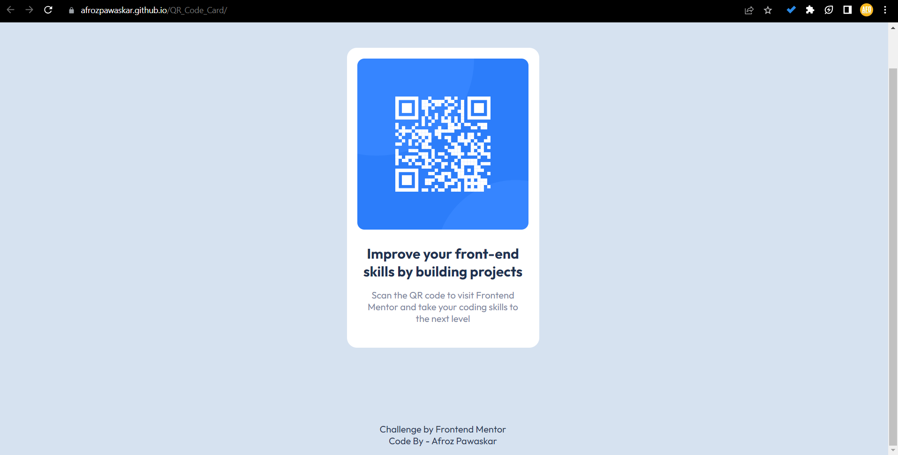

# QR Component

This project is a simple QR component that allows you to scan a QR code and visit Frontend Mentor to improve your front-end skills by building projects.

## Getting Started

To get started with this project, follow these steps:

1. Clone the repository to your local machine.
2. Open the `index.html` file in your web browser to view the QR component.

## Built With

- HTML
- CSS

## Acknowledgments

- Challenge by [Frontend Mentor](https://www.frontendmentor.io/challenges)
- Code By - [Afroz Pawaskar](https://github.com/afrozpawaskar17026)
